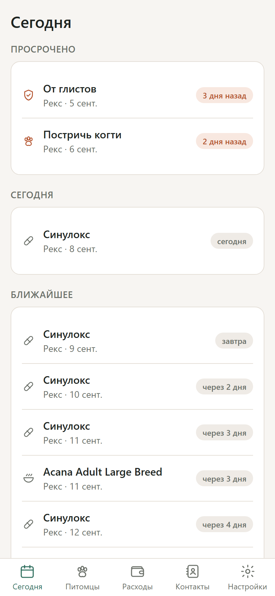
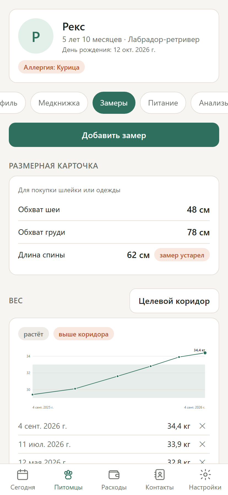
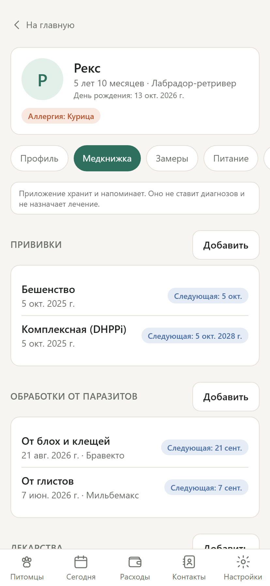
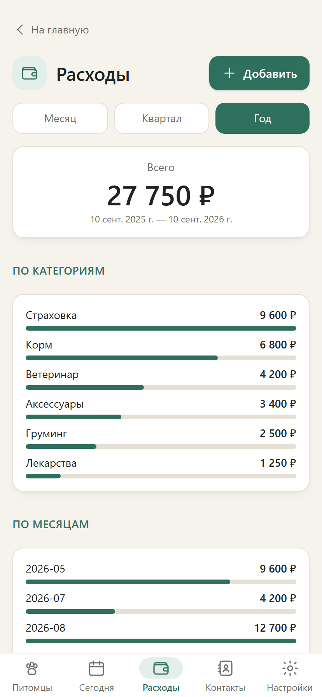
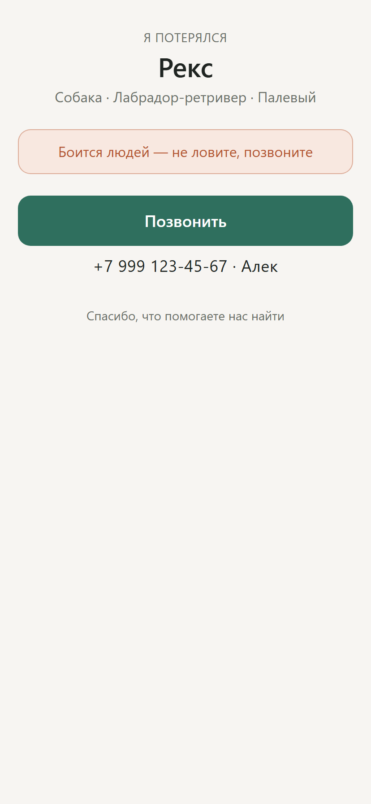
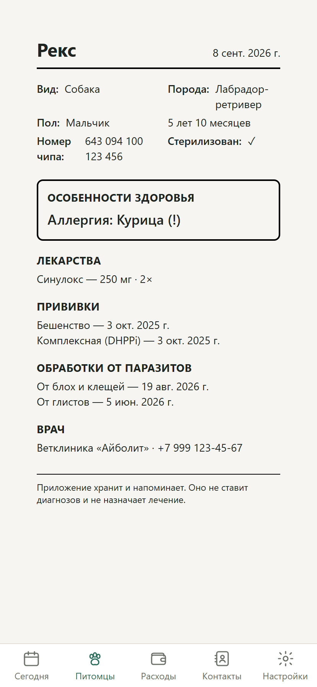
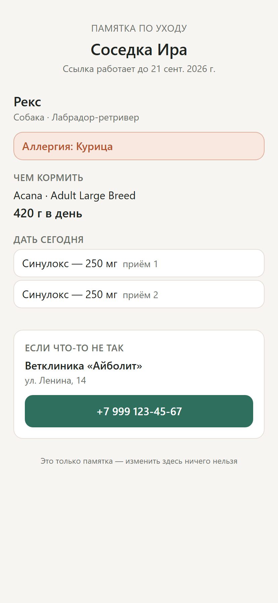

# pet-care-tracker

A self-hosted web application for pet owners: identity papers, medical record, body
measurements and care schedule in one place — installable to a phone's home screen, and
readable when there is no signal.

<p align="center">
  
  
  
</p>
<p align="center">
  
  
  
</p>
<p align="center">
  
</p>

## Why

A pet's history is normally scattered across a paper vaccination booklet, a folder of
scans, a notes app and somebody's memory. The parts that recur — revaccination,
antiparasitic treatment, document expiry, grooming — are exactly the parts that get
forgotten. This application keeps the record and turns the recurring parts into calendar
reminders that arrive whether or not the app is ever opened.

## Features

**Profile and documents.** Several pets per household. Full identity data: microchip with
format validation (ISO 11784/11785 and the pre-ISO formats still found in older animals),
tattoo, pedigree and registration numbers. Photos. Document files that warn _before_ they
expire rather than after.

**Medical record.** Vaccinations and antiparasitic treatments whose next-due dates are
computed from the animal's age and history. Visits. Allergies and chronic conditions,
flagged on the pet's header where a vet can see them without asking. Medication courses
expanded into individual doses to tick off.

**Laboratory results.** Values off a form charted over time against the range that
laboratory printed beside them. The application supplies no reference range of its own —
ranges differ between laboratories, species and machines, and inventing one would be exactly
the medical content this project stays out of. A series recorded in two different units is
flagged rather than drawn, because charting mmol/L against mg/dL as one line draws a cliff
that is not in the animal.

**Measurements.** Weight, body condition score and girths charted over time against a
target range, with a **size card** — the current neck, chest and back measurements, each
labelled with how old it is, for the moment you are standing in a shop holding a harness.

**Calendar and reminders.** Care events with two kinds of recurrence, a contact book of
vets and groomers with one-tap calling, and an **ICS feed** you subscribe to from your
phone's calendar so reminders arrive natively.

**Lost-pet tag.** A QR code for the collar. Whoever finds the animal scans it and gets one
screen with one action: call the owner. The page shows a name, a photo and a number — the
note is the owner's own words, so nothing from the medical record can reach it by accident,
and the microchip is deliberately absent (a finder cannot use it, a vet scans the animal
anyway). The token is replaceable, for when the tag comes off in a park.

**Emergency card.** The opposite disclosure choice: one printable page for a consulting
room, handed over in person, carrying the chip, the allergies, what the animal is currently
taking and when it was last vaccinated.

**Sitter link.** A temporary, read-only page for whoever is looking after the animal,
answering the questions somebody standing in a kitchen actually has: what must it never be
offered, what does it eat, what do I give today, what is coming, who do I ring. It names
only the pets that were handed over, stops working the day after a date the owner chose, and
can be revoked before then.

**Sharing.** A household, not an account, owns the pets — so adding a partner is adding a
member, with an editor or read-only role.

**Works on a phone.** A PWA added to the home screen on iOS and Android. Reads fall back to
the last cached copy, so the pet card opens in a waiting room with no signal.

### Two kinds of recurrence, and why it matters

This is the one design decision worth reading about.

- **On the calendar.** The next one is due a fixed interval from the original date. An
  annual booster is due next March whether or not this March's was given on time.
- **After it is done.** The next one is due a fixed interval from when the work _actually
  happened_. A wormer given three weeks late pushes the next one three weeks out, because
  what protects the animal is the interval since the last dose.

Modelling antiparasitic treatment or a nail trim as the first kind produces a schedule that
is quietly wrong in exactly the cases where it matters. Both kinds are first-class, and the
difference survives all the way into the calendar feed.

## Not medical advice

The application stores and reminds. It does not diagnose, does not check symptoms and does
not prescribe. Built-in vaccination and antiparasitic schedules follow the shape of
published guidance (WSAVA, ESCCAP) and exist to fill in a reminder date — every one is
labelled with where it came from and every one is editable. The veterinarian decides.

## Getting started

```bash
npm install
cp .env.example .env          # nothing secret in it; there are no third-party keys
npm run migrate               # create the SQLite file

# development: two servers, Vite proxying /api to Fastify
npm run api:dev
npm run web                   # http://127.0.0.1:5173

# or the shape production runs in: one process, one origin
npm run build
npm run local                 # http://127.0.0.1:5199
```

Register an account; the first user owns a household. **Save the recovery code shown at
registration** — there is no mail service here, so it is the only way back in if you forget
your password.

On anything reachable from the internet, set `SIGNUP_INVITE_CODE`. Open registration on an
instance that also accepts file uploads is an invitation to fill your volume; with the
variable set, the registration form asks for the code and refuses without it.

### Installing it on a phone

- **iOS (Safari):** Share → _Add to Home Screen_. It then opens without browser chrome, and
  the pet card works offline.
- **Android (Chrome):** menu → _Install app_.

After the first password login on a device with Face ID or a fingerprint reader, the app
offers to add a passkey. The password stays as the fallback for a device that has never
seen one.

### Subscribing to the reminders

Settings → _Calendar subscription_ gives a URL. Add it to Google Calendar
(_Other calendars → From URL_) or Apple Calendar (_File → New Calendar Subscription_), and
due dates arrive as ordinary calendar events with alarms at the lead time you chose.

This is deliberately the primary reminder channel. A subscribed calendar keeps working when
the application has not been opened in six months, on a phone that never granted a
notification permission — which no amount of web push can promise. The URL is a bearer
credential for the agenda (titles and dates only, no medical detail); it can be rotated
from the same screen.

## Architecture

A TypeScript monorepo on npm workspaces, arranged as a clean core under a thin layer.

| Package            | What lives there                                                                                                                                                                                                                               |
| ------------------ | ---------------------------------------------------------------------------------------------------------------------------------------------------------------------------------------------------------------------------------------------- |
| `packages/core`    | Every rule: civil-date arithmetic, both recurrence kinds, vaccination and antiparasitic scheduling, unit conversion, measurement series, iCalendar generation, and the zod schemas the API and the browser share. No I/O, no DOM, no database. |
| `packages/catalog` | Reference data only — default vaccine and antiparasitic schedules, body-condition scales. No computation.                                                                                                                                      |
| `apps/api`         | Fastify: routes parse, call a domain function and map errors. Session state and file storage live in `src/domain`.                                                                                                                             |
| `apps/web`         | React: presentation logic in `src/lib` (unit-tested), components render and delegate.                                                                                                                                                          |

Dates never pass through a `Date` in a local time zone — a birthday that moves by a day is
the classic way this kind of application loses trust. Month arithmetic clamps to the end of
the month: three months after 31 August is 30 November.

`docs/SPEC.md` is the full specification, written before the code and kept current.

## Tech stack

Fastify 5 · better-sqlite3 · Drizzle · zod · Argon2id · WebAuthn · sharp — React 19 · Vite ·
Tailwind 4 · `vite-plugin-pwa` — Vitest · Playwright · Fly.io.

## Tests and CI

```bash
npm test          # 318 tests
npm run typecheck
npm run capture   # seeds a demo household and photographs six screens
```

Everything in `packages/core` is unit-tested, including the cases that actually occur: a 29
February anniversary, a quarterly reminder anchored on the 31st, a pet whose birth date is
known only by year, a course of treatment completed three weeks late. API routes are tested
against a temporary SQLite database. Web presentation logic is tested; components are not.

Two structural tests earn their place. `schema-parity.test.ts` compares the hand-written DDL
against the Drizzle definitions column by column, which is what makes it safe not to run a
migration generator. And `npm run capture` drives the built application in a real browser
and fails on any console error — it is the check that caught three defects that reading the
code did not.

CI runs format, typecheck, tests and build on Ubuntu and Windows across Node 22 and 24, then
the browser pass on Ubuntu.

## Deployment

One Fly.io machine serving the API and the built front end from a single origin, with
SQLite and uploaded files on a persistent volume. Pushing to `main` deploys.

```bash
flyctl launch --no-deploy      # once
flyctl volumes create pet_data --size 1
```

```bash
flyctl secrets set SIGNUP_INVITE_CODE=something-only-you-know
```

Set `PUBLIC_ORIGIN` in `fly.toml` to the real hostname before the first deploy: WebAuthn
binds every passkey to an origin, so changing it later invalidates them (passwords still
work).

## Out of scope

Deliberately absent, not forgotten: a social feed, chat with a veterinarian, AI symptom
checking or diagnosis, breed recognition from photos, a marketplace, GPS tracking, and
integrations with specific clinic systems. Offline writes are also out of scope — reads
fall back to a cached copy, but a change that cannot reach the server fails loudly rather
than sitting in a queue an owner cannot see.

### Three public surfaces, three different answers

Each is reached by an opaque token and needs no account, and each shows a different amount
because a different person is reading it. That is the design, not an inconsistency.

| Surface       | Reader                        | Shows                                       | Ends                                  |
| ------------- | ----------------------------- | ------------------------------------------- | ------------------------------------- |
| Calendar feed | a calendar client             | titles and dates                            | when the token is rotated             |
| Lost tag      | a stranger holding the animal | name, photo, a number, the owner's own note | when the tag is turned off or rotated |
| Sitter link   | someone caring for the animal | allergies, ration, today's doses, the vet   | on a date the owner picked, or sooner |

Planned next: heat and pregnancy cycles, and web push alongside the calendar feed.

PDFs are produced by the browser's own print dialog rather than by a PDF library: "Save as
PDF" embeds the system's Cyrillic fonts correctly, which a JavaScript PDF writer would have
to be taught to do and would get subtly wrong.

## Licence

MIT — see [LICENSE](LICENSE).
